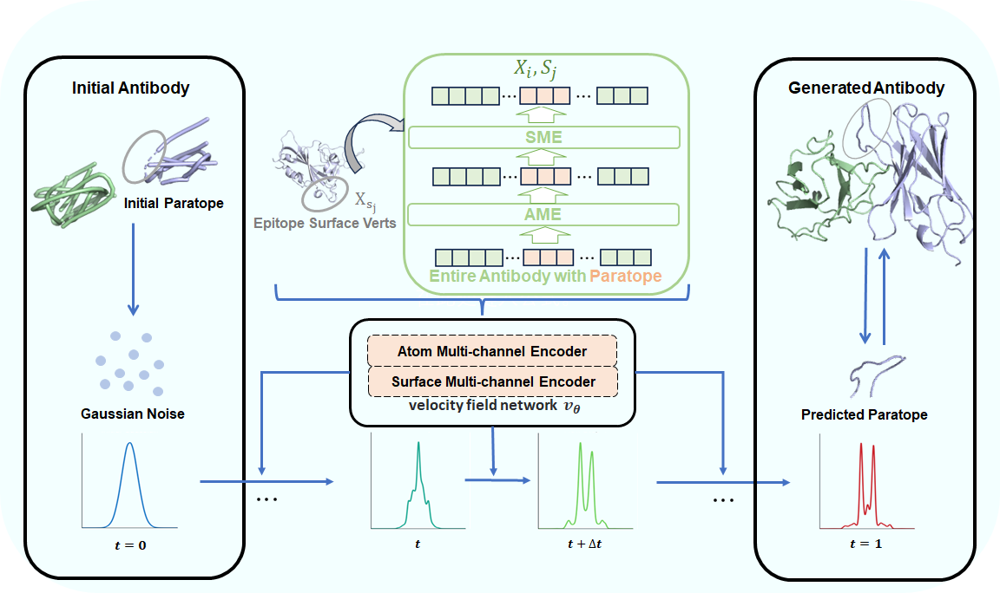

# AbFlow



AbFlow studies the antibody design problem centered on complementary determinants (CDRS), and addresses the coupling between local generation of CDRS and all-atomic information propagation, as well as the introduction of fine-grained structural information of antigens, through the message propagation mechanism of local flow matching and antigen surface enhancement.

## Table of Contents

- [Features](#features)
- [Installation](#installation)
- [Data and Model Weights](#data-and-model-weights)
- [Usage](#usage)
  - [Training](#training)
  - [Testing](#testing)
- [Citation](#citation)
- [License](#license)

## Features

- **Single-CDR Design**: Focus on specific CDR-H3 regions
- **Multi-CDR Design**: Design multiple complementarity-determining regions (CDRs) simultaneously
- **Structure Prediction**: Predict antibody structure from sequence
- **Affinity Optimization**: Optimize antibody-antigen binding affinity

## Installation

### Prerequisites

- Python 3.10
- CUDA 12.1 (for GPU support)
- Conda (recommended)

### Step 1: Clone the Repository

```bash
git clone https://github.com/wenda8759/AbFlow.git
cd AbFlow
```

### Step 2: Create Conda Environment

```bash
conda env create -f environment.yaml
conda activate AbFlow
```

### Step 3: Install PyTorch with CUDA Support

```bash
pip install torch==2.6.0 torchvision==0.19.1 torchaudio==2.4.1 --index-url https://download.pytorch.org/whl/cu124
pip install torch-scatter -f https://data.pyg.org/whl/torch-2.6.0+cu124.html
```

### Step 4: Install Additional Dependencies

```bash
pip install -r requirements.txt
```

### Step 5: Compile DockQ (Optional, for evaluation)

```bash
cd DockQ
make
cd ..
```

## Data and Model Weights

All datasets and pre-trained model weights are available on Hugging Face:

🤗 **[https://huggingface.co/wenda8759/AbFlow](https://huggingface.co/wenda8759/AbFlow)**

### Download Options

#### Option 1: Using huggingface-cli (Recommended)

```bash
# Install huggingface_hub if not already installed
pip install huggingface_hub

# Download all files
huggingface-cli download wenda8759/AbFlow --local-dir ./

# Or download specific files
huggingface-cli download wenda8759/AbFlow checkpoints/multi_cdr_design.ckpt --local-dir ./
```

#### Option 2: Using Python

```python
from huggingface_hub import snapshot_download, hf_hub_download

# Download entire repository
snapshot_download(repo_id="wenda8759/AbFlow", local_dir="./")

# Or download specific file
hf_hub_download(
    repo_id="wenda8759/AbFlow",
    filename="checkpoints/multi_cdr_design.ckpt",
    local_dir="./"
)
```


### Model Checkpoints

| Model | Description | File |
|-------|-------------|------|
| Paratope-Centric Design | Design based on epitope | `checkpoints/paratope_centric_design.ckpt` |
| Multi-CDR Design | Design all 6 CDR regions | `checkpoints/multi_cdr_design.ckpt` |
| Structure Prediction | Predict antibody structure | `checkpoints/structure_prediction.ckpt` |
| Affinity Optimization | Optimize binding affinity | `checkpoints/affinity_optimization.ckpt` |
| ΔΔG Predictor | Predict binding energy changes | `checkpoints/ddg_predictor.ckpt` |

### Dataset Structure

After downloading, organize your data as follows:

```
AbFlow/
├── datasets/
│   ├── RAbD/
│   │   ├── train.json
│   │   ├── valid.json
│   │   ├── test.json
│   │   ├── train.pkl
│   │   ├── valid.pkl
│   │   ├── test.pkl
│   │   ├── train_surf.pkl
│   │   ├── valid_surf.pkl
│   │   └── test_surf.pkl
│   └── IgFold/
│       ├── train.json
│       ├── valid.json
│       ├── test.json
│       └── ...
└── checkpoints/
    ├── multi_cdr_design.ckpt
    ├── structure_prediction.ckpt
    └── ...
```

## Usage

### Training

#### Training Different Tasks

```bash
# Multi-CDR Design
GPU=0,1 bash scripts/train/train.sh scripts/train/configs/multi_cdr_design.json

# Paratope-CDR Design
GPU=0,1 bash scripts/train/train.sh scripts/train/configs/single_cdr_design.json

# Structure Prediction
GPU=0,1 bash scripts/train/train.sh scripts/train/configs/struct_prediction.json

# Affinity Optimization (a △△G predictor need to be trained additionally.)
GPU=0,1 bash scripts/train/train.sh scripts/train/configs/single_cdr_opt.json

GPU=0 bash scripts/train/train_predictor.sh checkpoints/cdrh3_opt.ckpt
```

#### Distributed Training with Custom Settings

```bash
# Specify master address and port for distributed training
GPU=0,1 ADDR=localhost PORT=9901 bash scripts/train/train.sh scripts/train/configs/multi_cdr_design.json
```

### Testing

#### CDR Design Evaluation (Single GPU)

```bash
# Basic usage
GPU=0 bash scripts/test/test.sh <checkpoint> <test_set> [save_dir] [task]

# Example: Test multi-CDR design on RAbD dataset
GPU=0 bash scripts/test/test.sh \
    checkpoints/multi_cdr_design.ckpt \
    datasets/RAbD/test.json \
    results/multi_cdr_design \
    rabd
```

#### Structure Prediction Evaluation

```bash
GPU=0 bash scripts/test/test.sh \
    checkpoints/structure_prediction.ckpt \
    datasets/IgFold/test.json \
    results/struct_pred \
    igfold
```

#### Affinity Optimization Evaluation

```bash
GPU=0 bash scripts/test/optimize_test.sh \
    checkpoints/affinity_optimization.ckpt \
    checkpoints/ddg_predictor.ckpt \
    datasets/SKEMPI/test.json \
    0 \
    50 \
```
which will do 50 steps of gradient search without restrictions on the maximum number of changed residues (change 0 to any number to restrict the upperbound of $\Delta L$).

## Citation


## License

This project is licensed under the MIT License - see the [LICENSE](LICENSE) file for details.

## Acknowledgments

- [DockQ](https://github.com/bjornwallner/DockQ) for protein docking quality assessment
- [IgFold](https://github.com/Graylab/IgFold) for antibody structure prediction baseline
- [SAbDab](http://opig.stats.ox.ac.uk/webapps/newsabdab/sabdab/) for antibody structure database

## Contact

For questions or issues, please open an issue on GitHub or [contact the authors](wangwenda87@ruc.edu.cn).