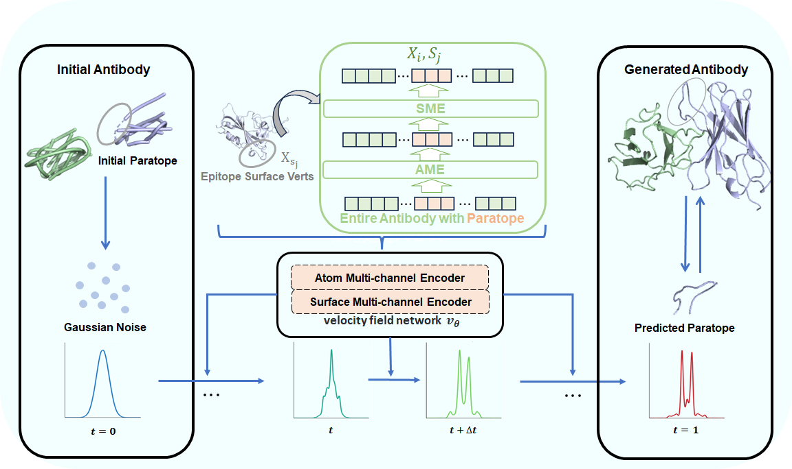

<h1 align="center">AbFlow:  End-to-end Paratope-Centric Antibody Design by Interaction Enhanced Flow Matching</h1>
<p align="center">
  <a href="https://dl.acm.org/doi/10.1145/3770854.3780296">
    
  </a>
</p>



AbFlow studies the antibody design problem centered on complementary determinants (CDRS), and addresses the coupling between local generation of CDRS and all-atomic information propagation, as well as the introduction of fine-grained structural information of antigens, through the message propagation mechanism of local flow matching and antigen surface enhancement.

## Table of Contents

- [Features](#features)
- [Installation](#installation)
- [Data and Model Weights](#data-and-model-weights)
- [Usage](#usage)
  - [Training](#training)
  - [Testing](#testing)
- [Citation](#citation)
- [License](#license)

## Features

- **Paratope-Centric Design**: Focus on specific CDR-H3 regions
- **Multi-CDRs Design**: Design multiple complementarity-determining regions (CDRs) simultaneously
- **Affinity Optimization**: Optimize antibody-antigen binding affinity
- **Structure Prediction**: Predict antibody structure from sequence


## Installation

### Prerequisites

- Python 3.10.14
- CUDA 12.4 (for GPU support)
- Conda (recommended)

### Step 1: Clone the Repository

```bash
git clone https://github.com/wenda8759/AbFlow.git
cd AbFlow
```

### Step 2: Create Conda Environment

```bash
conda env create -f environment.yaml
conda activate AbFlow
```

### Step 3: Install PyTorch with CUDA Support

```bash
pip install torch==2.6.0 torchvision==0.19.1 torchaudio==2.4.1 --index-url https://download.pytorch.org/whl/cu124
pip install torch_scatter -f https://data.pyg.org/whl/torch-2.6.0+cu124.html
```

### Step 4: Install Additional Dependencies

```bash
pip install -r requirements.txt
```

### Step 5: Compile DockQ (Optional, for evaluation)

```bash
cd DockQ
make
cd ..
```

## Data and Model Weights

All datasets and pre-trained model weights are available on Hugging Face:

🤗 **[https://huggingface.co/wenda8759/AbFlow](https://huggingface.co/wenda8759/AbFlow)**

### Download Options

#### Option 1: Using huggingface-cli (Recommended)

```bash
# Install huggingface_hub if not already installed
pip install huggingface_hub

# Download all files
huggingface-cli download wenda8759/AbFlow --local-dir ./

# Or download specific files
huggingface-cli download wenda8759/AbFlow checkpoints/multi_cdr_design.ckpt --local-dir ./
```

#### Option 2: Using Python

```python
from huggingface_hub import snapshot_download, hf_hub_download

# Download entire repository
snapshot_download(repo_id="wenda8759/AbFlow", local_dir="./")

# Or download specific file
hf_hub_download(
    repo_id="wenda8759/AbFlow",
    filename="checkpoints/multi_cdr_design.ckpt",
    local_dir="./"
)
```


### Model Checkpoints

| Model | Description | File |
|-------|-------------|------|
| Paratope-Centric Design | Design based on epitope | `checkpoints/paratope_centric_design.ckpt` |
| Multi-CDR Design | Design all 6 CDR regions | `checkpoints/multi_cdr_design.ckpt` |
| Structure Prediction | Predict antibody structure | `checkpoints/structure_prediction.ckpt` |
| Affinity Optimization | Optimize binding affinity | `checkpoints/affinity_optimization.ckpt` |
| ΔΔG Predictor | Predict binding energy changes | `checkpoints/ddg_predictor.ckpt` |

### Dataset Structure

After downloading, organize your data as follows:

```
AbFlow/
├── datasets/
│   ├── RAbD/
│   │   ├── train.json
│   │   ├── valid.json
│   │   ├── test.json
│   │   ├── train.pkl
│   │   ├── valid.pkl
│   │   ├── test.pkl
│   │   ├── train_surf.pkl
│   │   ├── valid_surf.pkl
│   │   └── test_surf.pkl
│   └── IgFold/
│       ├── train.json
│       ├── valid.json
│       ├── test.json
│       └── ...
└── checkpoints/
    ├── multi_cdr_design.ckpt
    ├── structure_prediction.ckpt
    └── ...
```

## Usage

### Training

#### Training Different Tasks

```bash
# Paratope-CDR Design
GPU=0,1 bash scripts/train/train.sh scripts/train/configs/single_cdr_design.json

# Multi-CDR Design
GPU=0,1 bash scripts/train/train.sh scripts/train/configs/multi_cdr_design.json

# Structure Prediction
GPU=0,1 bash scripts/train/train.sh scripts/train/configs/struct_prediction.json

# Affinity Optimization (a △△G predictor need to be trained additionally.)
GPU=0,1 bash scripts/train/train.sh scripts/train/configs/single_cdr_opt.json

GPU=0 bash scripts/train/train_predictor.sh checkpoints/cdrh3_opt.ckpt
```

### Testing

#### CDR Design Evaluation (Single GPU)

```bash
# Basic usage
GPU=0 bash scripts/test/test.sh <checkpoint> <test_set> [save_dir] [task]

# Example: Test multi-CDR design on RAbD dataset
GPU=0 bash scripts/test/test.sh \
    checkpoints/multi_cdr_design.ckpt \
    datasets/RAbD/test.json \
    results/multi_cdr_design \
    rabd
```

#### Structure Prediction Evaluation

```bash
GPU=0 bash scripts/test/test.sh \
    checkpoints/structure_prediction.ckpt \
    datasets/IgFold/test.json \
    results/struct_pred \
    igfold
```

#### Affinity Optimization Evaluation

```bash
GPU=0 bash scripts/test/optimize_test.sh \
    checkpoints/affinity_optimization.ckpt \
    checkpoints/ddg_predictor.ckpt \
    datasets/SKEMPI/test.json \
    0 \
    50 \
```
which will do 50 steps of gradient search without restrictions on the maximum number of changed residues (change 0 to any number to restrict the upperbound of $\Delta L$).

### Custom Dataset Processing and Surface Computation Pipeline

#### Directory Structure

The following directory structure is required:

```
base_dir/
├── prot_ids.txt          # One PDB entry name per line (e.g., 1abc_H_L_A)
├── fasta/
│   ├── 1abc_H_L_A.fasta  # One fasta file per entry
│   ├── 2xyz_H_L_B.fasta
│   └── ...
└── pdb/
    ├── 1abc.pdb           # Corresponding PDB structure files
    ├── 2xyz.pdb
    └── ...
```

**File format requirements:**

- `prot_ids.txt`: One entry name per line; the first 4 characters must be the PDB ID (e.g., `1abc_H_L_A`)
- `fasta/*.fasta`: Each file must contain at least 2 sequences, labeled as Heavy chain (H), Light chain (L), and optionally Antigen chain (A):

  ```
  >H
  QVQLQESGPGLVKPSETLSLTCTVSGSSLTSYGVHWVRQPPGKGLEGLGVIWPGGSTNYNSALMSRVTI
  SKDNSKSQVSLKMSSLTAADTAVYYCARVTGTWYFDVWGQGTTVTVSS
  >L
  DIQMTQSPSSLSASLGDRVTISCSASQGISNYLNWYQQKPDGTVKLLIYYTSTLHSGVPSRFSGSGSGT
  DYTLTISSLQPEDIATYYCQQYSKLPWTFGGGTKLEIK
  >A
  LQDPCSNCPAGTFCDNNRNQICSPCPPNSFSSAGGQRTCDICRQCKGVFRTRKECSSTSNAECDCTPGFH
  CLGAGCSMCEQDCKQGQELTKKGCKDCCFGTFNDQKRGICRPWTNCSLDGKSVLVNGTKERDVVCGPSPA
  DLSPGASSVTPPAPAREPGHSPQLEGGGHHHHHH
  ```

  `>H` denotes the Heavy chain, `>L` denotes the Light chain, and `>A` denotes the Antigen chain. Multiple antigen chains (e.g., `>A`, `>B`) are supported; antigen chains are optional.

- `pdb/`: Raw PDB structure files, used by `data/download.py` in subsequent steps.

---

#### Step 1: Generate summary.tsv

Run the following script to automatically generate `summary.tsv` from `prot_ids.txt` and the `fasta/` directory:

```bash
python create_summary.py --base_dir <your/base/directory>
```

The output `summary.tsv` has the following format:

```
pdb    Hchain    Lchain    antigen_chain    antigen_type
1abc   H         L         A                protein
```

---

#### Step 2: Generate the Standard Dataset File

Using `summary.tsv` and the PDB structures in `pdb/`, generate the standard `antibody_data.json`:

```bash
python data/download.py \
    --summary <base_dir>/summary.tsv \
    --fout <base_dir>/<dataset>.json \
    --type sabdab \
    --pdb_dir <base_dir>/pdb \
    --numbering imgt \
    --pre_numbered \
    --n_cpu 8
```

- `--pre_numbered`: Indicates that PDB files are already IMGT-numbered; skips the renumbering step
- `--numbering imgt`: Uses the IMGT numbering scheme to parse CDR regions
- `--n_cpu 8`: Number of CPU cores for parallel processing; adjust according to your server

The output `<dataset>.json` is the standard dataset format required for inference.

---

#### Step 3: Generate Molecular Surface Files

**Install MSMS (required for surface computation):**

```bash
conda install -c bioconda msms
```

**Compute the molecular surface feature file:**

```python
from data.surface import generate_surf_pkl
generate_surf_pkl("<dataset>.json",
                  "<surface>.pkl")
```

The output `<surface>.pkl` contains the antigen surface features required for inference.

## Citation


## License

This project is licensed under the MIT License - see the [LICENSE](LICENSE) file for details.

## Acknowledgments

- [DockQ](https://github.com/bjornwallner/DockQ) for protein docking quality assessment
- [IgFold](https://github.com/Graylab/IgFold) for antibody structure prediction baseline
- [SAbDab](http://opig.stats.ox.ac.uk/webapps/newsabdab/sabdab/) for antibody structure database

## Contact

For questions or issues, please open an issue on GitHub or [contact the authors](wangwenda87@ruc.edu.cn).
